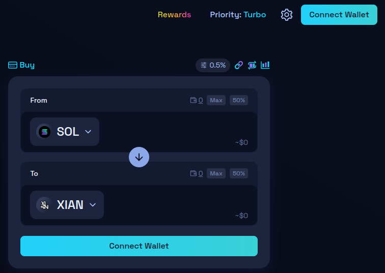
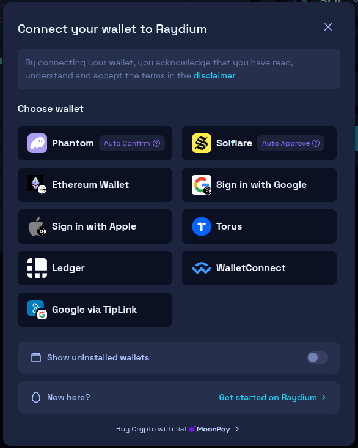
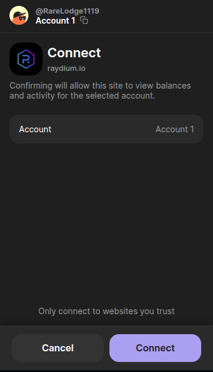
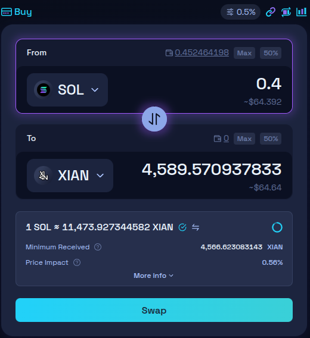
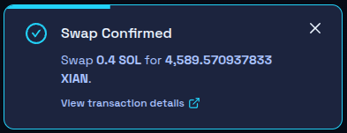
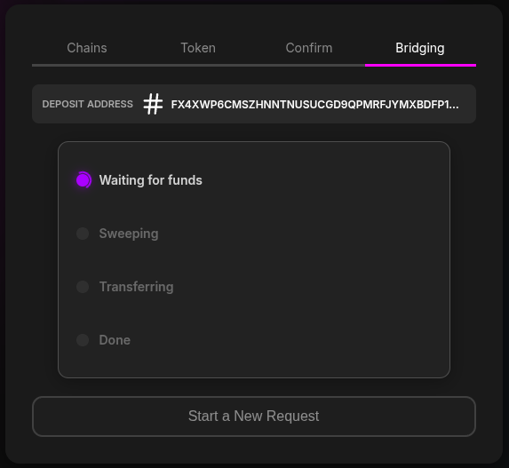
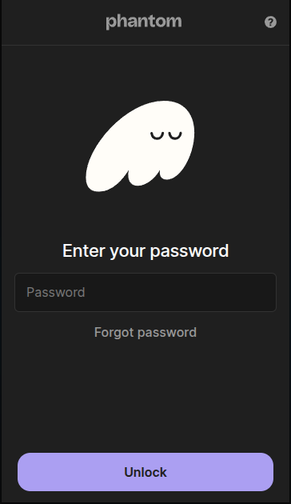
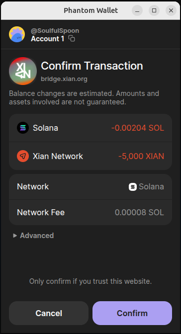
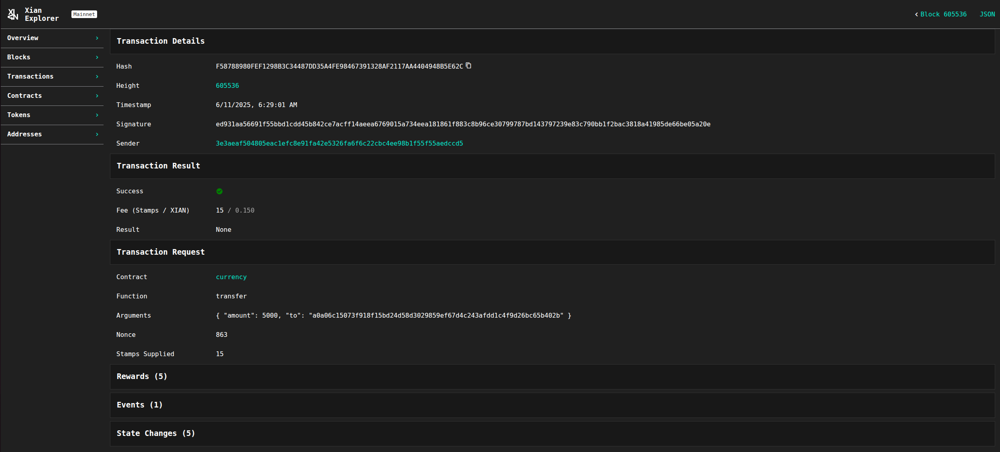

# 💱 How to Buy $SSS on Xian via Raydium and SNAKexchange on Desktop

This guide will walk you through:

- Swapping SOL for $XIAN using Raydium on Solana
- Bridging $XIAN to the Xian mainnet
- Buying $SSS on the native DEX, SNAKexchange.org

---

## 🔄 Step 1: Swap SOL for $XIAN on Raydium

1. **Connect Your Wallet**  
   - If you don't have one, install a Solana wallet like [Phantom](https://phantom.app/) which is preferred for bridging.
   - Procure SOL through your preferred means.
   - Go to [Raydium Swap](https://raydium.io/swap/?inputMint=sol&outputMint=GnaXkbmMV1zGK6bRCQnM9Jd6Jv2Hjw5b2PFVBaKEE5At). This link takes you to the direct swap page for the token GnaXkbmMV1zGK6bRCQnM9Jd6Jv2Hjw5b2PFVBaKEE5At which is the wrapped $XIAN token on Solana.
   - Click **I understand, confirm** for the $XIAN trading pair.
   
     
   - Click **Connect Wallet**.

   

   - Select **Phantom** (Or the other wallet you are using but this tutorial shows Phantom).
  
   

   - Log in to your wallet and click **Connect**.
  
   

   - If done properly, you should now see your wallet address in the top right corner of the Raydium page.
  
   

2. **Enter Amount and Swap**  
   - Input the amount of SOL to swap. Be sure to keep around 0.02 SOL for transaction fees.
   - Click **Swap**.  
  
   
 
   - Verify the details and confirm the transaction in your wallet.

   

   - Verify you see a **Swap Confirmed** message at the bottom right of your screen.
  
   

   Congratulations! You are now ready to Bridge to the $XIAN Mainnet!

---

## 🌉 Step 2: Bridge $XIAN to the Xian Mainnet

1. **Chains**  
   - Visit [https://bridge.xian.org](https://bridge.xian.org).
   - Select **From Solana** and **To Xian** on the **Chains** menu.
   - Click **Next**.

   

2. **Token**  
   - Select the token you would like to bridge. **XIAN** in this tutorial.
   - Enter the amount to bridge. Note that there is a minimum amount for each token and a small fee associated with using the bridge. The fee is a flat rate regardless of amount bridged.
   - Click **Next**.

   

3. **Confirm**  
   - Verify details of **From**, **To**, and **You Get** are all correct.
   - Click **Connect** for the Xian Wallet and Solana Wallet. Unlock wallets as needed.
   
   

   - Verify you see wallets as connected, and then click **Bridge**.
  
   
   
4. **Bridging**
   - You should now see this screen:
  
   

   - There will be a pop up to unlock and confirm the transaction on Solana in your Phantom Wallet. 
  
    

   - Once confirmed, the briding process will progress though **Waiting for funds**, **Sweeping**, **Transferring**, and **Done**. This process usually takes less than 1 minute, but wait at least 5-10 minutes before reaching out for support.
  
   

   - Click **Show Transaction** to open the XIAN explorer and confirm the transaction was successful as indicated by the ✅.
  
   

   - You may also verify the balance of XIAN in your Xian Wallet. 

---

## 🐍 Step 3: Purchase $SSS on SNAKexchange.org

1. **Open the Exchange**  
   - Visit [https://snakexchange.org](https://snakexchange.org)  
   - Click **Connect Wallet** and connect your Xian wallet

   

2. **Swap XIAN for SSS**  
   - From Token: `XIAN`  
   - To Token: `SSS`  
   - Enter the amount to swap  
   - Click **Swap** and approve in your wallet

   

3. **Verify Balance**  
   - Check your wallet to confirm receipt of $SSS tokens

---

## 📢 Stay Connected

- [Join Telegram](https://t.me/slither_on_xian)  
- [Follow on X](https://x.com/slither_on_xian)

---

## ✅ Summary

- 🔄 Swap SOL for $XIAN on Raydium  
- 🌉 Bridge $XIAN to Xian Mainnet  
- 🐍 Buy $SSS on SNAKexchange.org  

