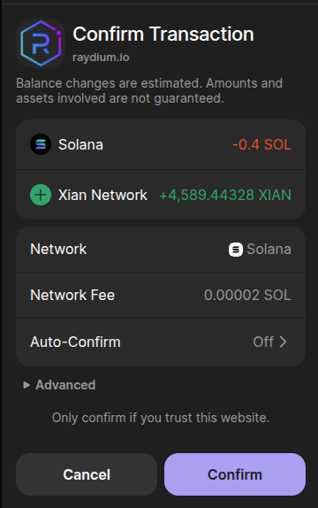
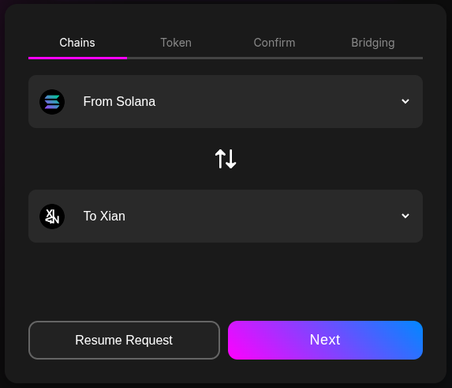
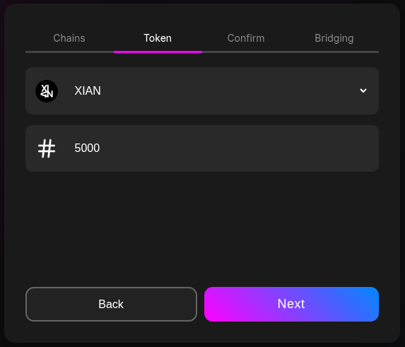
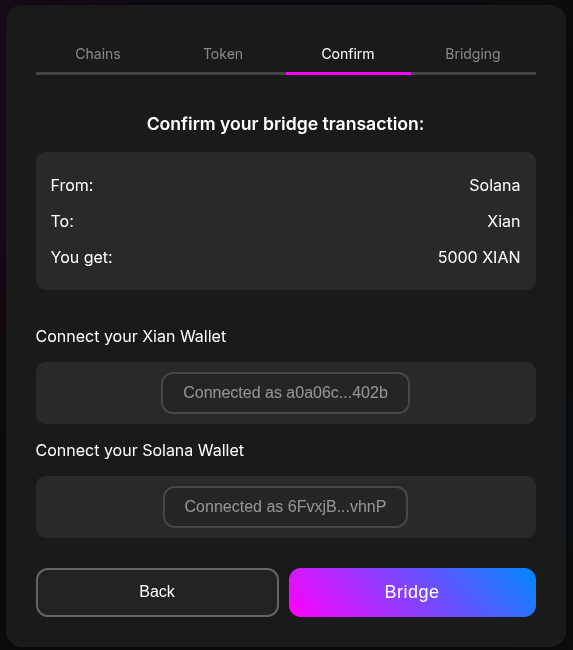
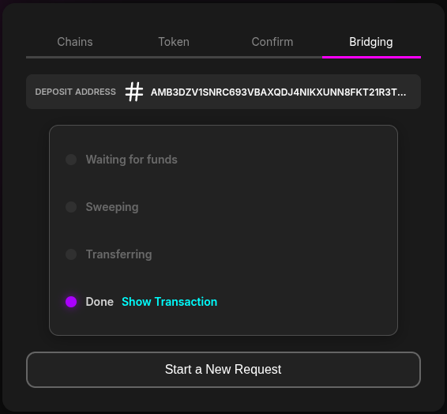
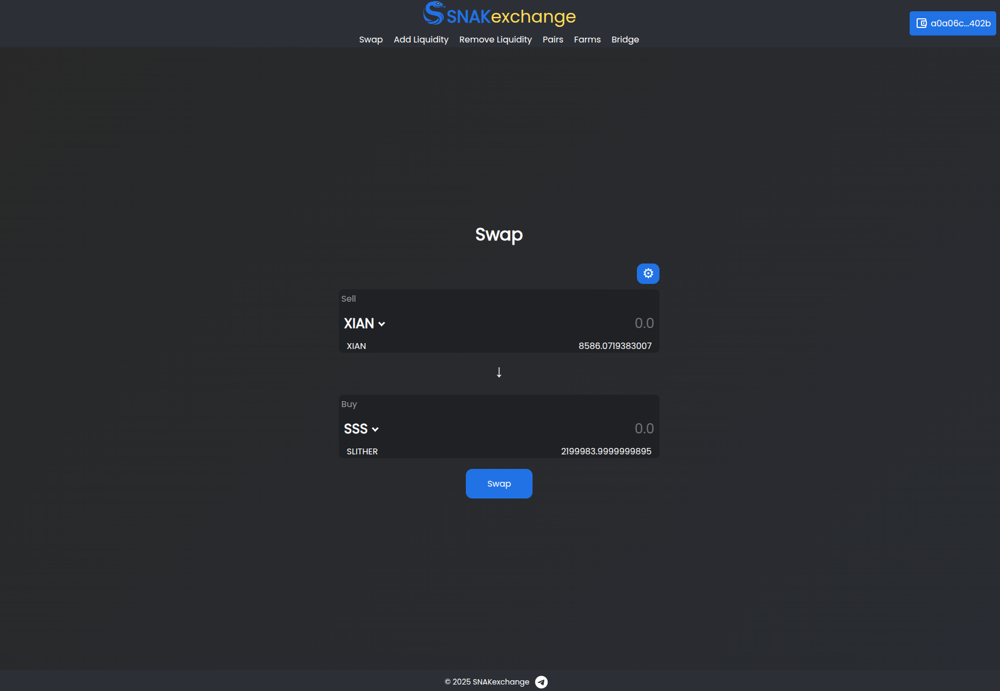
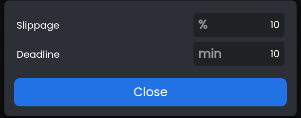
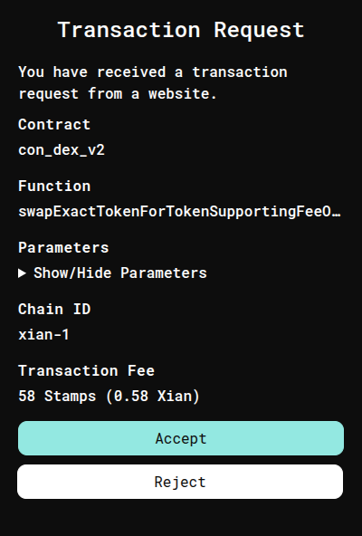

<!-- TABLE OF CONTENTS -->
## 📑 Table of Contents
1. [Step 1: Swap SOL to XIAN](#step-1-swap-sol-to-xian)  
2. [Step 2: Bridge XIAN to Mainnet](#step-2-bridge-xian-to-mainnet)  
3. [Step 3: Buy SSS on SNAKexchange](#step-3-buy-sss-on-snakexchange)  
4. [Quick-Links](#quick-links)  

---

### 🔄 Step 1: Swap SOL to XIAN

> ⚠️ **Keep at least `0.02 SOL`** in your wallet to cover fees.  
> 💡 **Tip:** If slippage >3%, click the ⚙️ icon in the swap widget to adjust.

1. **Open Raydium Swap**  
   - Visit [Raydium Swap][raydium].  
   - Click **I understand, confirm** when prompted for the $XIAN trading pair.  

   <figure>
     
     <figcaption>Confirm token pair</figcaption>
   </figure>

2. **Connect Your Wallet**  
   - Click **Connect Wallet → Phantom → Connect**.  
   - You’ll see your wallet address appear in the top-right.  

   <figure>
     
     <figcaption>✅ Wallet connected</figcaption>
   </figure>

3. **Enter Amount & Swap**  
   1. In “You Pay,” enter the SOL amount (leave ~`0.02 SOL` for fees).  
   2. Click **Swap**, then confirm in your Phantom popup.  
   3. Wait for the **Swap Confirmed** banner.

   <figure>
     
     <figcaption>Confirm and wait for success</figcaption>
   </figure>

**✅ Step 1 Complete!** You now have wrapped `$XIAN`.  
Proceed to 🌉 **Step 2: Bridge** below.

---

### 🌉 Step 2: Bridge XIAN to Mainnet

> ⚠️ **Bridge Fee:** Flat rate per transaction, regardless of amount.

1. **Select Chains**  
   - Visit [XIAN Bridge][bridge].  
   - Set **From**: Solana → **To**: Xian → **Next**.

   <figure>
     
     <figcaption>Choose source/destination chains</figcaption>
   </figure>

2. **Pick Token & Amount**  
   - Select **XIAN** as the token.  
   - Enter amount (observe minimum).  
   - Click **Next**.

   <figure>
     
     <figcaption>Enter amount to bridge</figcaption>
   </figure>

3. **Confirm & Connect**  
   - Verify **From**, **To**, and **You Get**.  
   - Click **Connect** under both wallets; unlock as needed.  
   - Hit **Bridge**.

   <figure>
     
     <figcaption>Ready to bridge</figcaption>
   </figure>

4. **Wait for Completion**  
   - Follow status: *Waiting for funds* → *Sweeping* → *Transferring* → *Done*.  
   - Typical time: <1 minute (allow up to 10m).

   <figure>
     
     <figcaption>Bridge complete</figcaption>
   </figure>

5. **Verify on Explorer**  
   - Click **Show Transaction** → view ✅ on XIAN Explorer.  
   - Confirm balance in your Xian wallet.

**✅ Step 2 Complete!** You now have native `$XIAN`.  
Next: 🐍 **Step 3: Buy $SSS**.

---

### Step 3: Buy SSS on SNAKexchange

> ⚠️ **Slippage:** Default 3%. If price impact >3%, adjust via ⚙️.

1. **Open SNAKexchange**  
   - Go to [snakexchange.org][snak].  
   - Unlock your Xian wallet when prompted; refresh if still “Wallet Locked.”

   <figure>
     
     <figcaption>Wallet connected</figcaption>
   </figure>

2. **Configure Swap**  
   - **Sell**: `XIAN` → **Buy**: `SSS`.  
   - Enter amount (e.g., `1000`).  
   - Adjust slippage if needed.

   <figure>
     
     <figcaption>Set slippage just above price impact</figcaption>
   </figure>

3. **Approve & Swap**  
   - Click **Swap** → confirm **Approve** in popup → confirm **Swap**.  
   - Wait 1–3s for transaction.

   <figure>
     
     <figcaption>Swap complete; check wallet</figcaption>
   </figure>

4. **Verify Receipt**  
   - Check your wallet for `$SSS` balance.

**✅ All Done!** You now own `$SSS`. 

---

### 🚀 Quick-Links

- [Raydium Swap][raydium]  
- [XIAN Bridge][bridge]  
- [SNAKexchange][snak]  
- [Join $SSS Telegram][tg-sss]  
- [Join $XIAN Telegram][tg-xian]  

---

[raydium]: https://raydium.io/swap/?inputMint=sol&outputMint=GnaXkbmMV1zGK6bRCQnM9Jd6Jv2Hjw5b2PFVBaKEE5At  
[bridge]: https://bridge.xian.org  
[snak]: https://snakexchange.org/?token0=currency&token1=con_slither  
[tg-sss]: https://t.me/slither_on_xian  
[tg-xian]: https://t.me/xian_network  
